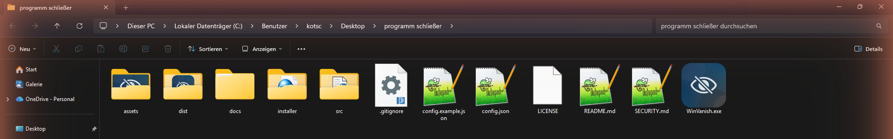

<div align="center">


### Ein Tastendruck. Alles weg.

Minimiert **beliebig viele Fenster gleichzeitig** (Browser, Discord, Spiele wie *Civilization V* …),
mutet den Ton und pausiert das Video – per selbst gewählter Taste. Nochmal drücken, und alles ist
wieder genauso da, wie es war.

[](#-installation)
[](LICENSE)
[](https://kotsch.tech)

**[⬇️ Download für Windows auf kotsch.tech](https://kotsch.tech)** · [Funktionen](#-funktionen) · [Installation](#-installation) · [Bedienung](#-bedienung) · [Projektstruktur](#-projektstruktur)

</div>

---

## 🤔 Warum WinVanish?

Der Chef kommt rein, ein Elternteil betritt den Raum, ein Discord-Call soll sofort weg – und zwar
**alles auf einmal**, nicht Fenster für Fenster. WinVanish läuft unsichtbar im Hintergrund und
reagiert auf eine einzige, selbst gewählte Taste (Standard: `F8`).

## ✨ Funktionen

| | |
|---|---|
| 🎯 **Mehrere Ziele gleichzeitig** | Browser, Discord, ein Spiel im Vollbild – **eine** Taste steuert beliebig viele Programme auf einmal. |
| 🎮 **Spiele-tauglich** | Nutzt dasselbe robuste Minimieren wie Alt+Tab – funktioniert auch bei Vollbild-Titeln wie *Civilization V*. Reagiert ein älteres Spiel nicht, wird automatisch mit Force-Minimize nachgeholfen. |
| 🔇 **Ton & Video** | Muted die System-Lautstärke und sendet die Media-Play/Pause-Taste, damit YouTube/Netflix wirklich pausiert. |
| ↩️ **Perfekt rückgängig** | Jedes Fenster kehrt exakt in seinen vorherigen Zustand zurück (maximiert bleibt maximiert). |
| 🌗 **Adaptives Icon** | Das Tray-Icon erkennt live, ob Windows im hellen oder dunklen Design läuft, und wechselt automatisch – ganz ohne Neustart. |
| ⌨️ **Frei wählbare Taste** | Einzelne Taste oder Kombination (`Strg+Shift+M`, `F9`, `Druck`, …) – vom Tray-Menü aus in Sekunden eingerichtet. |
| 🚀 **Autostart** | Optional startet WinVanish selbst automatisch mit Windows – und/oder deine Zielprogramme starten automatisch mit, falls sie gerade nicht laufen. |
| 🪶 **Leichtgewichtig** | Eine einzelne, in sich geschlossene `.exe` (Icons sind eingebettet) – keine losen Dateien, keine Hintergrunddienste außer dem Tray-Icon selbst. |

## 📸 Screenshots

<table>
<tr>
<td align="center" width="50%">
<br>
<sub><b>Dunkles Windows-Design</b> – Icon erkennt das Theme automatisch</sub>
</td>
<td align="center" width="50%">
<br>
<sub><b>Helles Windows-Design</b> – Live-Wechsel ohne Neustart</sub>
</td>
</tr>
</table>

<p align="center">
<br>
<sub>Aufgeräumte Projektstruktur mit sauber abgerundetem App-Icon im Windows Explorer</sub>
</p>

## ⬇️ Installation

WinVanish wird als fertiger, signierter **Installer** und als **portable Einzeldatei** auf
**[kotsch.tech](https://kotsch.tech)** bereitgestellt. Dieses GitHub-Repository enthält den
vollständigen Quellcode und die Build-Skripte – wer selbst bauen möchte, findet alles nötige unten
unter [Selbst bauen](#️-selbst-bauen).

1. Installer bzw. `WinVanish.exe` von [kotsch.tech](https://kotsch.tech) herunterladen
2. Ausführen – die App läuft unsichtbar im Hintergrund, ein Icon erscheint im System-Tray
3. Fertig: Tray-Icon rechtsklicken, um Taste und Ziel-Programme einzurichten

> **Windows SmartScreen / Defender:** Als kleines, frisch veröffentlichtes Tool hat WinVanish noch
> keine große Installationsbasis, daher kann SmartScreen anfangs warnen ("Unbekannter Herausgeber").
> Über **"Weitere Informationen" → "Trotzdem ausführen"** startet die App normal. Der komplette
> Quellcode in diesem Repository ist offen einsehbar. Details zur Signatur: [SECURITY.md](SECURITY.md).

## 🕹️ Bedienung

### Taste ändern
Tray-Icon → **„Taste ändern…“** → gewünschte Taste/Kombination drücken. Sofort gespeichert.

### Mehrere Ziel-Fenster festlegen

**Variante A – anklicken/wechseln:**
1. Tray-Icon → **„Ziel-Fenster hinzufügen…“**
2. Innerhalb von 4 Sekunden zum gewünschten Fenster wechseln (z. B. Civilization V anklicken)
3. Schritt 1+2 beliebig oft wiederholen – Chrome, Discord, ein Spiel, …

**Variante B – aus der Liste auswählen (kein Wechseln nötig):**
1. Tray-Icon → **„Aus offenen Fenstern wählen“**
2. Untermenü zeigt alle gerade offenen Fenster/Programme als Checkboxen
3. Beliebig viele anhaken – **Mehrfachauswahl**, direkt im Tray-Menü, ohne Extra-Fenster

Ab jetzt schaltet **eine** Taste **alle** diese Programme gleichzeitig. „Ziel-Fenster entfernen“ /
„Alle Ziele zurücksetzen“ passen die Liste jederzeit an.

> **Immer synchron:** WinVanish merkt sich nicht nur "ein/aus", sondern prüft bei jedem
> Tastendruck den tatsächlichen Zustand jedes Ziel-Fensters. Wurde eins zwischendurch von Hand
> wieder geöffnet, minimiert der nächste Tastendruck **alle erneut**, statt sie durcheinander zu
> bringen – restauriert wird nur, wenn wirklich alle gerade minimiert sind.

### Weitere Optionen (Tray-Menü)
- **Video pausieren beim Verstecken** – sendet zusätzlich Media-Play/Pause
- **Ziele automatisch mitstarten** – startet fehlende Zielprogramme direkt mit WinVanish
- Beim Installer zusätzlich: **WinVanish automatisch mit Windows starten** (als Option beim Setup)

## 📁 Projektstruktur

```
WinVanish/
├── src/
│   └── winvanish.py        # Kompletter Quellcode (eine Datei, ~460 Zeilen)
├── assets/
│   ├── icon.ico             # App-Icon (mehrere Auflösungen, abgerundet)
│   ├── icon-light.png        # Tray-Icon fuer helles Windows-Design
│   └── icon-dark.png         # Tray-Icon fuer dunkles Windows-Design
├── installer/
│   ├── WinVanish.iss         # Inno-Setup-Skript fuer den Windows-Installer
│   └── version_info.txt      # Datei-Metadaten (Herausgeber, Version, ...)
├── docs/
│   └── screenshots/          # Bilder fuer dieses README
├── config.example.json       # Beispiel-Konfiguration
├── LICENSE
├── SECURITY.md
└── README.md
```

Beim Ausführen legt WinVanish automatisch eine `config.json` neben der `.exe` an (persönliche
Einstellungen, nicht Teil des Repos – siehe `config.example.json` für das Format).

## 🔒 Sicherheit & Datenschutz

- Kein Netzwerkzugriff, keine Telemetrie, keine Cloud-Anbindung
- Einstellungen liegen ausschließlich lokal in `config.json` neben der `.exe`
- Quelloffen – der komplette Code in [`src/winvanish.py`](src/winvanish.py) kann eingesehen werden
- Details zur Codesignierung: [SECURITY.md](SECURITY.md)

## 🛠️ Selbst bauen

```bash
pip install keyboard pycaw comtypes pywin32 psutil pillow pystray pyinstaller

python -m PyInstaller --onefile --noconsole --name "WinVanish" ^
  --icon assets/icon.ico ^
  --version-file installer/version_info.txt ^
  --add-data "assets/icon-light.png;." ^
  --add-data "assets/icon-dark.png;." ^
  --distpath dist --workpath build ^
  src/winvanish.py
```

Die fertige, in sich geschlossene `WinVanish.exe` liegt danach in `dist\` (Icons sind eingebettet –
keine losen Dateien nötig).

### Installer selbst bauen
Mit installiertem [Inno Setup](https://jrsoftware.org/isinfo.php):
```bash
ISCC.exe installer/WinVanish.iss
```
Ergebnis liegt in `installer/Output/WinVanish-Setup.exe`.

## 🗺️ Roadmap

- [ ] macOS-Version (**MacVanish**)
- [ ] Offizielles Code-Signing-Zertifikat (EV/OV) für SmartScreen-Vertrauen ohne Warnung
- [ ] Eigene Tasten pro Zielprogramm (statt nur „alle gleichzeitig“)

## 🤝 Mitwirken

Issues und Pull Requests sind willkommen! Bitte vorher kurz in den Issues nachsehen, ob dein Anliegen
schon existiert.

## 📄 Lizenz

[MIT](LICENSE) © [Kotsch.Tech](https://kotsch.tech) – Arthur Kotsch

---

<div align="center">
<sub>Gebaut von <a href="https://kotsch.tech">Kotsch.Tech</a> · <a href="https://github.com/Ifreedom666I">GitHub</a></sub>
</div>
